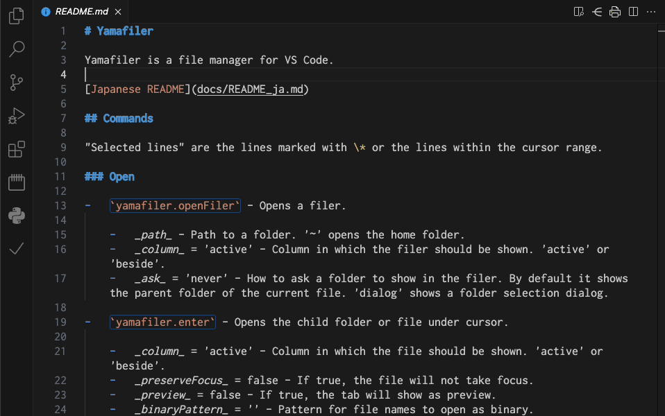

# Yamafiler

Yamafiler is a file manager for VS Code.

[Japanese README](docs/README_ja.md)

## Configuration

-   `yamafiler.useRecommendedKeybindings` - Use recommended keybindings shown below.

| Key                | Operation                                        |
| ------------------ | ------------------------------------------------ |
| `Ctrl` `Shift` `Y` | Open filer                                       |
| `Shift` `` ` ``    | Open home folder                                 |
| `O`                | Open the same folder to the side                 |
| `H`                | Open parent folder                               |
| `J`                | Move cursor down                                 |
| `K`                | Move cursor up                                   |
| `L`                | Open child folder/file                           |
| `E`/`Enter`        | Open child folder/file (open file as text)       |
| `Shift` `P`        | Open file to the side                            |
| `Z`                | Refresh                                          |
| `Q`                | Close filer                                      |
| `W`                | Open workspace                                   |
| `Shift` `W`        | Open workspace in a new window                   |
| `Space`            | Select/Deselect                                  |
| `Shift` `8`        | Select/Deselect all lines                        |
| `Shift` `K`        | New folder                                       |
| `Shift` `N`        | New file                                         |
| `Shift` `M`        | New multiple folders and files                   |
| `R`                | Rename                                           |
| `C`                | Duplicate in the same folder                     |
| `Shift` `S`        | Create symlink in the same folder (Linux, macOS) |
| `D`                | Delete                                           |
| `M`                | Move                                             |
| `Y`                | Copy                                             |
| `Shift` `T`        | Target of symlink (Linux, macOS)                 |
| `P`                | Paste                                            |

If the keys conflict with those of other extensions, please adjust them manually.
Another extension such as `vscode-pdf` is needed to preview `.pdf` files.
An equivalent keybindings.json file is available [here](docs/keybindings.json).

## Commands

"Selected lines" are the lines marked with \* or the lines within the cursor range.

### Open

-   `yamafiler.openFiler` - Opens a filer.

    -   _path_ - Path to a folder. '~' opens the home folder.
    -   _column_ = 'active' - Column in which the filer should be shown. 'active' or 'beside'.
    -   _ask_ = 'never' - How to ask a folder to show in the filer. By default it shows the parent folder of the current file. 'dialog' shows a folder selection dialog.

-   `yamafiler.enter` - Opens the child folder or file under cursor.

    -   _column_ = 'active' - Column in which the file should be shown. 'active' or 'beside'.
    -   _preserveFocus_ = false - If true, the file will not take focus.
    -   _preview_ = false - If true, the tab will show as preview.
    -   _binaryPattern_ = '' - Pattern for file names to open as binary.
    -   _externalPattern_ = '' - Pattern for file names to open in an external application.
    -   _externalFolderPattern_ = '' - Pattern for folder names to open in an external application.

-   `yamafiler.goToParent` - Opens the parent folder of the current folder.
-   `yamafiler.refresh` - Updates the contents of the folder.
    -   _resetSelection_ = false - If true, discard the selection.
-   `yamafiler.openWorkspace` - Opens the workspace under cursor. A workspace is a `.code-workspace` file or a folder.
    -   _forceNewWindow_ = false - If true, the workspace will be opened in a new window.
-   `yamafiler.addToWorkspace` - Adds the selected folders to the workspace.

### File operations

-   `yamafiler.newFolder` - Creates a new folder by entering a name.
-   `yamafiler.newFile` - Creates a new file by entering a name.
-   `yamafiler.newMultipleFiles` - Create new folders and files by batch file.
-   `yamafiler.rename` - Renames the selected folders and files. Batch file is used for multiple selection.
-   `yamafiler.duplicate` - Copies the selected folders and files to the current folder with the name you enter. Batch file is used for multiple selection.
-   `yamafiler.symlink` - Creates symbolic links to the selected folders and files. Batch file is used for multiple selection (Linux, macOS).
-   `yamafiler.delete` - Deletes the selected folders and files.

### File operations with clipboard

-   `yamafiler.cut` - Cuts the selected folders and files.
-   `yamafiler.copy` - Copies the selected folders and files.
-   `yamafiler.targetForSymlink` - Specifies the selected folders and files as the targets of symbolic links (Linux, macOS).
-   `yamafiler.paste` - Pastes the folders and files from the clipboard into the current folder. It cannot be executed in the source of the clipboard.

### File selection

-   `yamafiler.select` - Selects the cursor line and mark it with \*.
-   `yamafiler.deselect` - Deselects the cursor line.
-   `yamafiler.toggleSelection` - Toggles selection of the cursor line.
-   `yamafiler.toggleSelectionAll` - Toggles selection of all lines.

## License

Licensed under the [MIT](LICENSE) license.

## Thanks

-   [Shougo/defx.nvim](https://github.com/Shougo/defx.nvim) - Source of idea
-   [shirou/vscode-dired](https://github.com/shirou/vscode-dired) - Pioneer
-   [JannisX11/batch-rename](https://github.com/JannisX11/batch-rename) - Batch function
