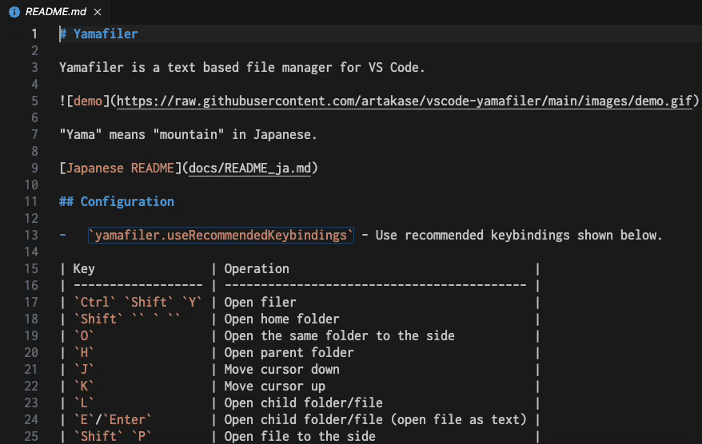

# Yamafiler

Yamafiler は VS Code 用のファイルマネージャーです。

## 設定

-   `yamafiler.useRecommendedKeybindings` - 以下に示す推奨のキーバインドを使用します。

| キー                                                 | 操作                                                        |
| ---------------------------------------------------- | ----------------------------------------------------------- |
| `Ctrl` `Shift` `Y`                                   | 起動                                                        |
| `Shift` `` ` ``  日本語キーボードでは `Shift` `'` | ホームフォルダーを開く                                      |
| `O`                                                  | 同じフォルダーを隣のカラムにも開く                          |
| `H`                                                  | 親フォルダーを開く                                          |
| `J`                                                  | カーソルを下に移動                                          |
| `K`                                                  | カーソルを上に移動                                          |
| `L`                                                  | 子フォルダー/ファイルを開く                                 |
| `E`/`Enter`                                          | 子フォルダー/ファイルを開く（ファイルはテキストとして開く） |
| `Shift` `P`                                          | ファイルを隣のカラムで開く                                  |
| `Z`                                                  | フォルダーの内容を更新                                      |
| `Q`                                                  | ファイラーを閉じる                                          |
| `W`                                                  | ワークスペースを開く                                        |
| `Shift` `W`                                          | ワークスペースを新しいウィンドウで開く                      |
| `Space`                                              | 選択/選択解除                                               |
| `Shift` `8`                                          | 全ての行を選択/選択解除                                     |
| `Shift` `K`                                          | 新しいフォルダー                                            |
| `Shift` `N`                                          | 新しいファイル                                              |
| `Shift` `M`                                          | 新しい複数のフォルダーとファイル                            |
| `R`                                                  | リネーム                                                    |
| `C`                                                  | 同じフォルダーに複製                                        |
| `Shift` `S`                                          | 同じフォルダーにシンボリックリンクを作成（Linux, MacOS）    |
| `D`                                                  | ごみ箱に移動                                                |
| `M`                                                  | 移動                                                        |
| `Y`                                                  | コピー                                                      |
| `Shift` `T`                                          | シンボリックリンクのターゲットに指定（Linux, MacOS）        |
| `P`                                                  | ペースト                                                    |

キーが他の拡張機能と衝突する場合は手動で調整してください。
`.pdf` ファイルをプレビューするには、`vscode-pdf` などの拡張機能が別途必要です。
同等の keybindings.json は [こちら](keybindings.json) を参照してください。

## コマンド

選択されている行とは、\*マークが付いた行があればその行、無ければカーソル範囲の行のことを表します。

### 開く

-   `yamafiler.openFiler` - Yamafiler を開きます。

    -   _path_ - フォルダーのパスです。'~' にするとホームフォルダーを開きます。'${workspaceFolder}' にするとワークスペースフォルダーを開きます。
    -   _column_ = 'active' - ファイラーを開くカラムです。'active' または 'beside' です。
    -   _ask_ = 'never' - ファイラーで表示するフォルダーを尋ねるかどうかを選択します。デフォルトでは現在のファイルの親フォルダーを表示します。'dialog' にするとフォルダー選択ダイアログを表示します。

-   `yamafiler.enter` - カーソル行の子フォルダーまたはファイルを開きます。

    -   _column_ = 'active' - ファイルを開くカラムです。'active' または 'beside' です。
    -   _preserveFocus_ = false - ファイルを開くとき、ファイラーにフォーカスしたままにするかを指定します。
    -   _preview_ = false - ファイルをプレビューで開くかを指定します。
    -   _binaryPattern_ = '' - バイナリとして開くファイルの名前のパターンです。
    -   _externalPattern_ = '' - 外部アプリケーションで開くファイルの名前のパターンです。
    -   _externalFolderPattern_ = '' - 外部アプリケーションで開くフォルダーの名前のパターンです。

-   `yamafiler.goToParent` - 現在表示しているフォルダーの親フォルダーを開きます。
-   `yamafiler.refresh` - フォルダーの内容を更新します。
    -   _resetSelection_ = false - 選択を破棄するかを指定します。
-   `yamafiler.openWorkspace` - カーソル上のワークスペースを開きます。ワークスペースはワークスペース設定ファイルまたはフォルダーです。
    -   _forceNewWindow_ = false - ワークスペースを新しいウィンドウで開くかを選択します。
-   `yamafiler.addToWorkspace` - 選択されているフォルダーをワークスペースに追加します。

### ファイル操作

-   `yamafiler.newFolder` - 名前を入力して新しいフォルダーを作成します。
-   `yamafiler.newFile` - 名前を入力して新しいファイルを作成します。
-   `yamafiler.newMultipleFiles` - バッチを使用して新しいフォルダーとファイルを作成します。
-   `yamafiler.rename` - 選択されているフォルダーまたはファイルの名前を変更します。複数選択時はバッチを使用します。
-   `yamafiler.duplicate` - 選択されているフォルダーまたはファイルを入力した名前で現在のフォルダーに複製します。複数選択時はバッチを使用します。
-   `yamafiler.symlink` - 選択されているフォルダーまたはファイルへのシンボリックリンクを作成します。複数選択時はバッチを使用します（Linux, MacOS）。
-   `yamafiler.delete` - 選択されているフォルダーまたはファイルを削除します。

### クリップボードを使用したファイル操作

-   `yamafiler.cut` - 選択されているフォルダーまたはファイルをカットします。
-   `yamafiler.copy` - 選択されているフォルダーまたはファイルのコピーを作成します。
-   `yamafiler.targetForSymlink` - 選択されているフォルダーまたはファイルをシンボリックリンクのターゲットとして指定します（Linux, MacOS）。
-   `yamafiler.paste` - クリップボードのファイルをファイラーのフォルダーに貼り付けます。クリップボードに書き込んだフォルダーを開いているときには実行できません。

### ファイル選択

-   `yamafiler.select` - カーソル行を選択し、\* マークを付けます。
-   `yamafiler.deselect` - カーソル行の選択を解除します。
-   `yamafiler.toggleSelection` - カーソル行の選択をトグルします。
-   `yamafiler.toggleSelectionAll` - 全ての行の選択をトグルします。

## ライセンス

[MIT](../LICENSE) license のもとに公開します。

## 感謝

-   [Shougo/defx.nvim](https://github.com/Shougo/defx.nvim) - アイデアの源
-   [shirou/vscode-dired](https://github.com/shirou/vscode-dired) - 先駆者
-   [JannisX11/batch-rename](https://github.com/JannisX11/batch-rename) - バッチ機能
